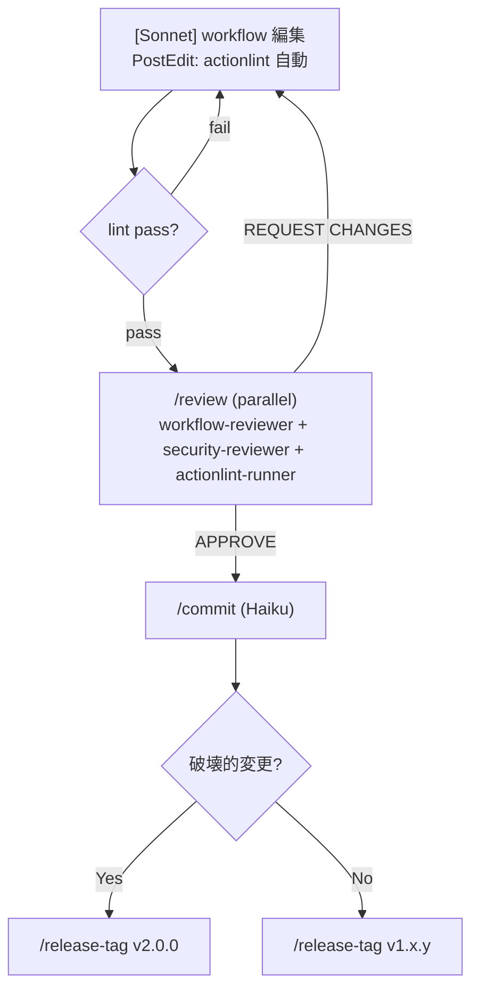
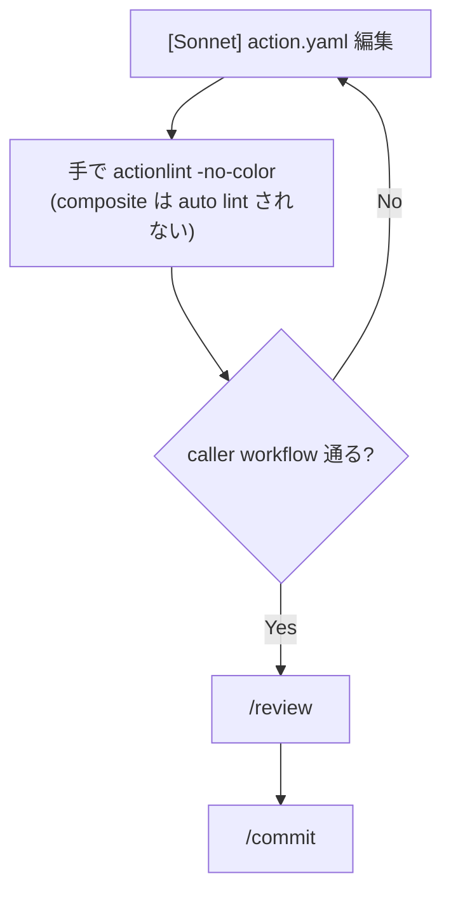
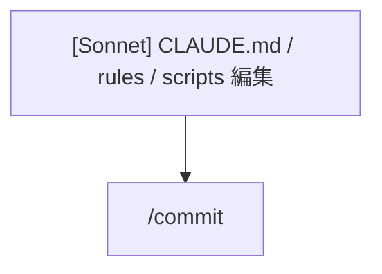

# 開発フロー正典 (dev-flow)

qfour-workflows の変更パターンと、それぞれで必須となるゲート・コマンド
の正典。CLAUDE.md は概要のみ持ち、詳細はこのファイルを参照する。

## パターン自動判定

`git diff --name-only main...HEAD` の結果から判定。

| 変更ファイル | パターン |
|---|---|
| `.github/workflows/*.yaml` | **W: 再利用可能 workflow** |
| `.github/actions/*/action.yaml` | **A: composite action** |
| `.claude/**`, `CLAUDE.md`, `README.md`, `scripts/**` | **M: メタ / ドキュメント** |

Stop hook (`scripts/claude-hook-stop.sh`) がセッション終了時に
actionlint を自動で走らせ、dirty file 数を表示する。

---

## パターン W: Workflow 変更 (`.github/workflows/`)



| ゲート | タイミング | 必須 | コマンド |
|---|---|---|---|
| actionlint | PostEdit 自動 | ✅ | `scripts/claude-hook-postedit.sh` |
| /review | PR 直前 | ✅ | `/review` |
| /security-audit | permissions / secrets / OIDC を変更時 | ✅ | `/security-audit` |
| /commit | review pass 後 | ✅ | `/commit` |

---

## パターン A: Composite action 変更 (`.github/actions/`)



composite action は actionlint の workflow 文法では検査できない。
caller workflow (`docker-build.yaml`, `image-pipeline.yaml`) を通じた
間接検証のみ。**caller の input/output 名と齟齬がないか手動で確認** する。

| ゲート | タイミング | 必須 | コマンド |
|---|---|---|---|
| `yq '.runs.using'` で sanity check | 編集後 | ✅ | `yq '.runs.using' .github/actions/*/action.yaml` |
| caller 経由 actionlint | 編集後 | ✅ | `actionlint -no-color` |
| /review | PR 直前 | ✅ | `/review` |

---

## パターン M: メタ / ドキュメント変更



CI のロジックを変えないので review は不要 (任意で `/review` でも可)。
ただし `scripts/claude-hook-*.sh` は次セッションで走るので、`shellcheck`
を手で通すこと。

---

## 全ゲート早見表

| ゲート | W | A | M |
|---|---|---|---|
| actionlint (PostEdit) | ✅ 自動 | — (composite は対象外) | — |
| actionlint (Stop) | ✅ 自動 | ✅ 自動 | — |
| /review | ✅ 必須 | ✅ 必須 | 任意 |
| /security-audit | permissions 変更時 | permissions 変更時 | — |
| /validate | 任意 (mechanical 確認) | 任意 | — |
| /commit | ✅ 必須 | ✅ 必須 | ✅ 必須 |
| /release-tag | merge 後に手動 | merge 後に手動 | 不要 |

---

## リリースフロー

詳細は [`.claude/skills/release-tag.md`](../skills/release-tag.md) を参照。

```
1. main にマージ
2. /release-tag v1.2.3
   → git tag v1.2.3 (pinned)
   → git tag -f v1 (moving major; force OK)
3. ユーザー承認 → push
4. gh release create v1.2.3 --generate-notes
```

**破壊的変更** (caller の input/output rename, 既存 default 変更) は
`v1` を進めず `v2.0.0` を切る。

---

## CI との役割分担

| チェック | ローカル | CI |
|---|---|---|
| actionlint | PostEdit hook 自動 | `.github/workflows/ci.yaml` で PR blocking |
| /review | PR 直前 | (なし — レビュアー人間が見る) |
| Dependabot | (なし) | weekly で third-party action 更新 PR |

ローカルの `/review` が事実上の最終ゲート。CI actionlint は安全網。
