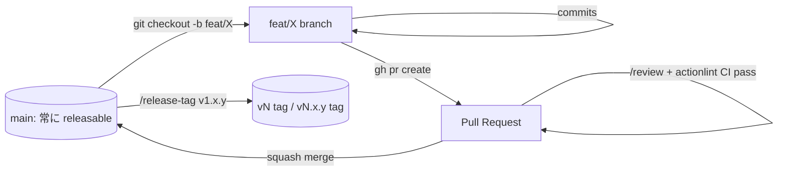
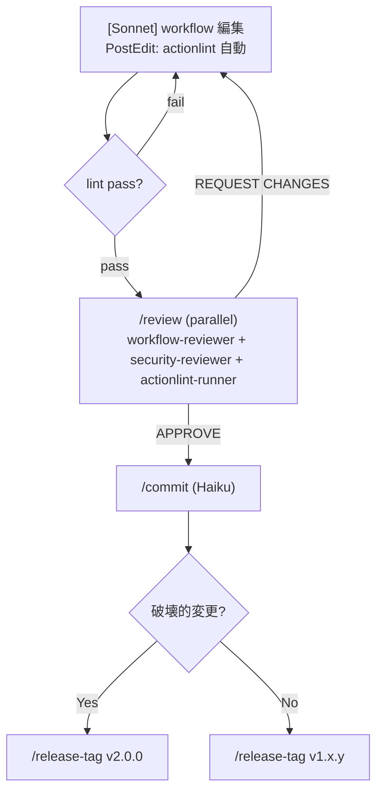
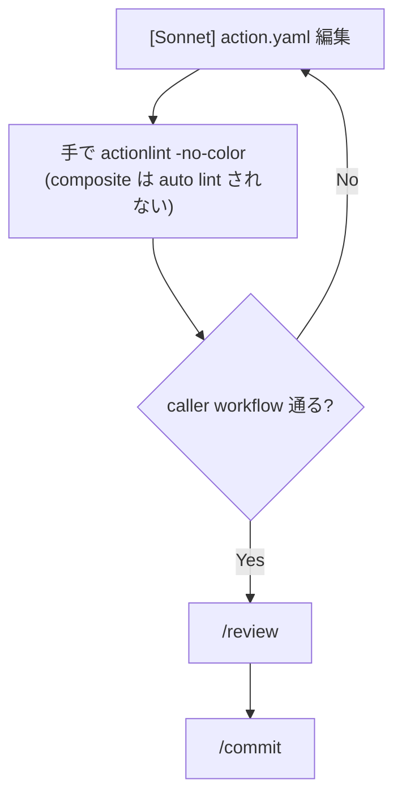
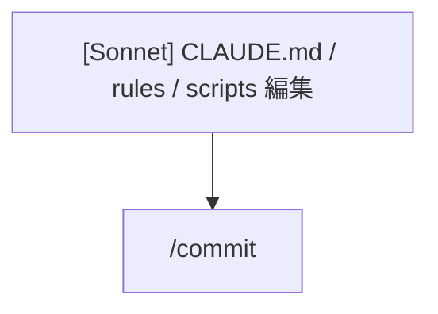

# 開発フロー正典 (dev-flow)

homelab-workflows の変更パターンと、それぞれで必須となるゲート・コマンド
の正典。CLAUDE.md は概要のみ持ち、詳細はこのファイルを参照する。

## Branch 戦略 — GitHub Flow

このリポジトリは **GitHub Flow** を採用する。`main` だけが長期ブランチ
であり、それ以外は短命な feature/topic branch を切って PR で main に
マージする。



### Hard rules

| # | ルール |
|---|---|
| B1 | `main` への **直接コミット禁止**。必ず branch を切る (`git checkout -b <type>/<slug>`) |
| B2 | `main` への **force-push 禁止**。moving tag (`v1` 等) のみ force 許可 |
| B3 | branch 名は `<type>/<slug>` 形式 (`type` = `feat`/`fix`/`refactor`/`chore`/`docs`/`ci`、`slug` は kebab-case) |
| B4 | PR は **squash merge** がデフォルト。複数 commit を 1 commit にまとめてから main に乗せる |
| B5 | `/review` + CI (`.github/workflows/ci.yaml` の actionlint) が **両方 pass** していないと merge 不可 |
| B6 | merge 後の feature branch は **削除**。GitHub UI / `gh pr merge --delete-branch` で自動削除 |
| B7 | 破壊的変更 (input/output rename, default 変更) の PR は **タイトルに `[breaking]`** を入れる |

### 1 PR の粒度

- **最小単位 1 つ** で 1 PR を理想とする。`docker-build.yaml` の変更と
  `sysdig-scan.yaml` の変更を 1 PR に混ぜない。
- **例外**: 設計上 atomic な変更 (新規 input 追加 + caller 例の更新 +
  README) は 1 PR に入れて構わない。
- **CLAUDE 設定の変更** (`.claude/**`, `scripts/claude-hook-*`) は
  workflow 変更とは別 PR に切る。

### Claude Code セッションでの実行

新規 PR を始めるとき、main にいる Claude セッションは:

1. **拒否する**: 編集を始める前に "main に直接コミットしようとして
   いる" 状態なら、branch を切るよう促す。
2. branch 名を提案: 変更内容から `<type>/<slug>` を推測してユーザー
   に確認。
3. ユーザー承認後: `git checkout -b <type>/<slug>` 実行。
4. 作業 → `/review` → `/commit` → push → `gh pr create`。

`committer` agent は `git branch --show-current` を確認し、`main` に
いる場合は commit を **拒否してユーザーに branch 作成を促す**。

### コミット → push → PR の典型コマンド

```bash
# 1. branch を切る
git checkout main && git pull origin main
git checkout -b feat/add-helm-lint

# 2. 編集 → /review → /commit (本セッションで)

# 3. push と PR 作成
git push -u origin feat/add-helm-lint
gh pr create --title "feat(workflows): add helm-lint" --body "$(cat <<'EOF'
## Summary
- ...

## Test plan
- [ ] /validate
- [ ] /review
EOF
)"

# 4. CI + レビュー pass → squash merge
gh pr merge --squash --delete-branch
```

### Branch protection (GitHub UI で設定)

リポジトリ管理者が以下を main に設定する想定:

- ✅ Require pull request before merging
- ✅ Require status checks: `actionlint` (`.github/workflows/ci.yaml`)
- ✅ Require linear history (force squash/rebase)
- ✅ Restrict pushes that create matching branches
- ✅ Do not allow bypassing the above settings (含 admin)

このリポでは Claude も含めて **誰も main に直 push しない**。

---

## パターン自動判定

`git diff --name-only main...HEAD` の結果から判定。

| 変更ファイル | パターン |
|---|---|
| `.github/workflows/*.yaml` | **W: 再利用可能 workflow** |
| `.github/actions/*/action.yaml` | **A: composite action** |
| `.claude/**`, `CLAUDE.md`, `README.md`, `scripts/**` | **M: メタ / ドキュメント** |

Stop hook (`scripts/claude-hook-stop.sh`) がセッション終了時に
actionlint を自動で走らせ、dirty file 数を表示する。

---

## パターン W: Workflow 変更 (`.github/workflows/`)



| ゲート | タイミング | 必須 | コマンド |
|---|---|---|---|
| actionlint | PostEdit 自動 | ✅ | `scripts/claude-hook-postedit.sh` |
| /review | PR 直前 | ✅ | `/review` |
| /security-audit | permissions / secrets / OIDC を変更時 | ✅ | `/security-audit` |
| /commit | review pass 後 | ✅ | `/commit` |

---

## パターン A: Composite action 変更 (`.github/actions/`)



composite action は actionlint の workflow 文法では検査できない。
caller workflow (`docker-build.yaml`, `image-pipeline.yaml`) を通じた
間接検証のみ。**caller の input/output 名と齟齬がないか手動で確認** する。

| ゲート | タイミング | 必須 | コマンド |
|---|---|---|---|
| `yq '.runs.using'` で sanity check | 編集後 | ✅ | `yq '.runs.using' .github/actions/*/action.yaml` |
| caller 経由 actionlint | 編集後 | ✅ | `actionlint -no-color` |
| /review | PR 直前 | ✅ | `/review` |

---

## パターン M: メタ / ドキュメント変更



CI のロジックを変えないので review は不要 (任意で `/review` でも可)。
ただし `scripts/claude-hook-*.sh` は次セッションで走るので、`shellcheck`
を手で通すこと。

---

## 全ゲート早見表

| ゲート | W | A | M |
|---|---|---|---|
| actionlint (PostEdit) | ✅ 自動 | — (composite は対象外) | — |
| actionlint (Stop) | ✅ 自動 | ✅ 自動 | — |
| /review | ✅ 必須 | ✅ 必須 | 任意 |
| /security-audit | permissions 変更時 | permissions 変更時 | — |
| /validate | 任意 (mechanical 確認) | 任意 | — |
| /commit | ✅ 必須 | ✅ 必須 | ✅ 必須 |
| /release-tag | merge 後に手動 | merge 後に手動 | 不要 |

---

## リリースフロー

詳細は [`.claude/skills/release-tag.md`](../skills/release-tag.md) を参照。

```
1. main にマージ
2. /release-tag v1.2.3
   → git tag v1.2.3 (pinned)
   → git tag -f v1 (moving major; force OK)
3. ユーザー承認 → push
4. gh release create v1.2.3 --generate-notes
```

**破壊的変更** (caller の input/output rename, 既存 default 変更) は
`v1` を進めず `v2.0.0` を切る。

---

## CI との役割分担

| チェック | ローカル | CI |
|---|---|---|
| actionlint | PostEdit hook 自動 | `.github/workflows/ci.yaml` で PR blocking |
| /review | PR 直前 | (なし — レビュアー人間が見る) |
| Dependabot | (なし) | weekly で third-party action 更新 PR |

ローカルの `/review` が事実上の最終ゲート。CI actionlint は安全網。
